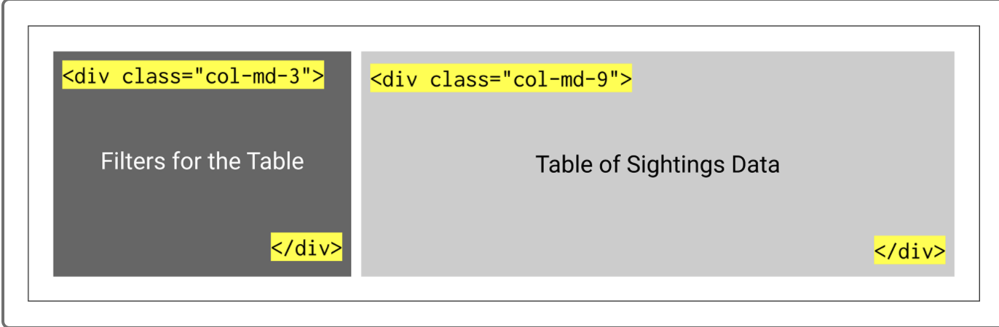

# Mission-To-Mars

---

## Overview

## Resources
* Data Sources: hawaii.sqlite
* Software: Python 3.7.10, Jupyter Notebook 6.3.0, sqlAlchemy, sqlite 

## Results

### Deliverable 1

### Deliverable 2

### Deliverable 3

## Summary

Jill Hughes
