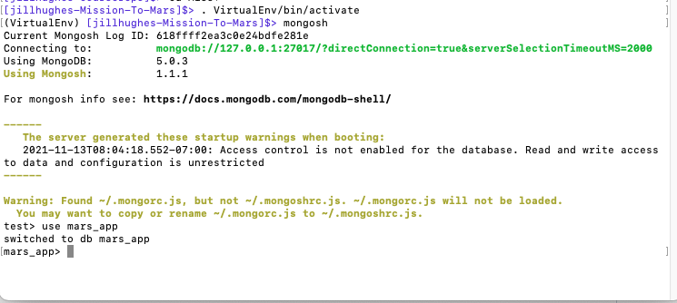

# Mission-To-Mars


---

## Overview
This project is to create an application that can keep up-to-date on the latest Mars News, published on the NASA news website, utilizing Web Scraping cabilities and presenting them into a web page, that can be refreshed upon a simple button click. 

I will be using several different websites for '_web scraping_' and software tools to accomplish this task.

## Resources
* Data Sources/Web Sites:
  * https://data-class-mars.s3.amazonaws.com/Mars/index.html
  * https://spaceimages-mars.com
  * https://galaxyfacts-mars.com
  * https://marshemispheres.com
* Software: Python 3.7.10, Jupyter Notebook 6.3.0, Pandas, BeautifulSoup, Splinter, ChromeDriverManager, Flask, PyMongo, MongoDB, HTML5 Bootstrap 3

---

### Process
**WebScraping**
- I had to understand the overall process of _Web Scraping_ and how my application's flow would work.


**HTML5**
- I had to understand how to use HTML Tags, and set up my _index.html_ file utilizing the basic html setup for web-pages.


**Web Page Layout**
- I had to design how my application (Web Page) would look like and where the results I retrieved would show up at.


**HTML Tags and Web Page Layout**
- With the HTML5 tags known, and my Web Layout designed, it was now time to determine where these 2 areas met.

    

**Database Setup**
- Starting up my Virtual Environment, starting up my MongoDB Database


**Application Startup**
- Starting my Virtual Environment in another concole, and starting up my application
- Then open up Chrome and entering the URL: http://127.0.0.1:5000


## Results

### Deliverable 1
**Scrape Full-Resolution Mars Hemisphere Images and Titles**

 ---
 ```
def featured_image(browser):
    # Visit URL
    url = 'https://spaceimages-mars.com'
    browser.visit(url)

    # Find and click the full image button
    full_image_elem = browser.find_by_tag('button')[1]
    full_image_elem.click()
    # Parse the resulting html with soup
    html = browser.html
    img_soup = soup(html, 'html.parser')

    # Add try/except for error handling
    try:
        # Find the relative image url
        img_url_rel = img_soup.find('img', class_='fancybox-image').get('src')
    except AttributeError:
        return None

    # Use the base url to create an absolute url
    img_url = f'https://spaceimages-mars.com/{img_url_rel}'
    return img_url
```
---
### Deliverable 2
**Update the Web Application with Mars Hemisphere Images and Titles**

---
```
def mars_hemis(browser):
    # 1. Use browser to visit the URL 
    url = 'https://marshemispheres.com/'
    browser.visit(url)

    # 2. Create a list to hold the images and titles.
    hemisphere_image_urls = []
    # 3. Write code to retrieve the image urls and titles for each hemisphere.   
    for image in range(4):
        # search for images
        browser.links.find_by_partial_text('Hemisphere')[image].click()
        # parse the html
        html = browser.html
        html_soup = soup(html, 'html.parser')
        # scrape
        title = html_soup.find('h2', class_='title').text
        img_url = html_soup.find('li').a.get('href')
        # store image into a dictionary
        hemispheres = {}
        hemispheres['img_url'] = f'https://marshemispheres.com/{img_url}'
        hemispheres['title'] = title
        hemisphere_image_urls.append(hemispheres)
        # set browser back to repeat
        browser.back()
    return hemisphere_image_urls
```
---
### Deliverable 3
**Add Bootstrap 3 Components**

---
The following area's of code in the _index.html_ were modified so that the application can be viewed on a Mobile Device.  the "col-AA-##"  value was changed to 'xs' - so it can be adjusted to a cell phone if viewed there.  
```
<head>
   <meta charset="UTF-8" />
   <meta name="viewport" content="width=device-width, initial-scale=1.0" />
```
---
```
<div class="row" id="mars-news">
    <div class="col-xs-12 text-center">
```
---
```
<div class="row" id="mars-news">
    <div class="col-xs-12 text-center">
```
---
```
<div class="col-xs-4">
    <div class="row" id="mars-facts">
```
---
```
<div class="col-xs-3">
    <div class="thumbnail">
```
---
I also modified the following area of code to have the "container" to be of "container-fluid" to be able to handle Mobile devices.
```
<body>
    <div class="container-fluid">
```
---
The last area I modified, was to update the Mars Fact table, to be responsive.
```
<div class="table-responsive">
    <table class="table">{{ mars.facts | safe }}</table>                
```
---
## Summary


Jill Hughes
